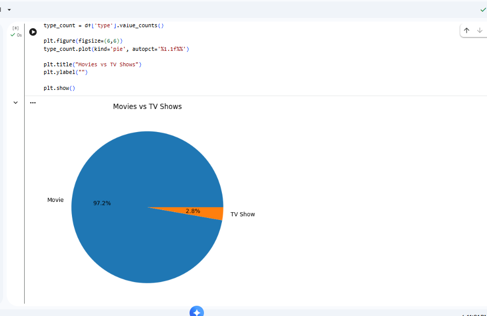
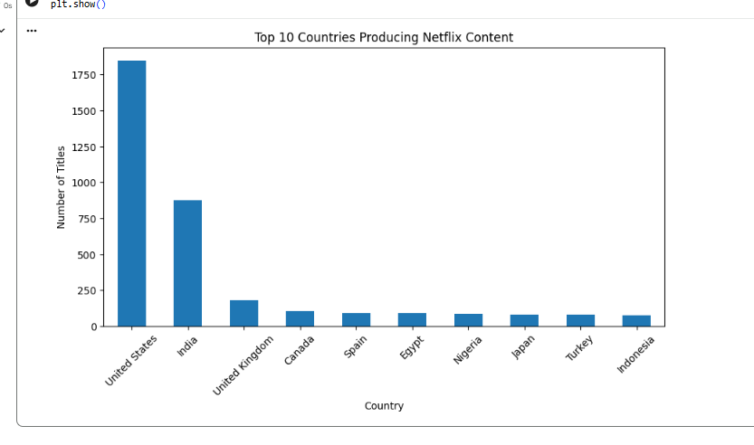
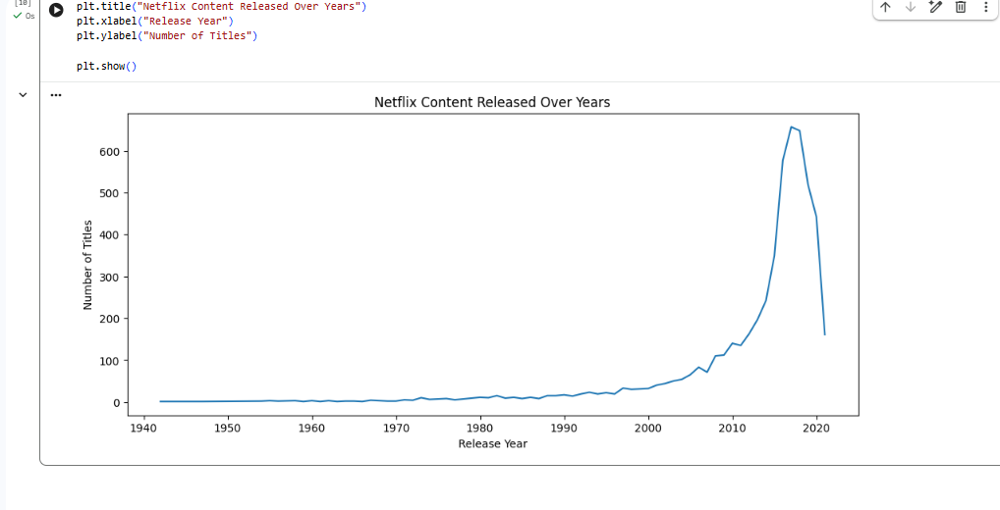
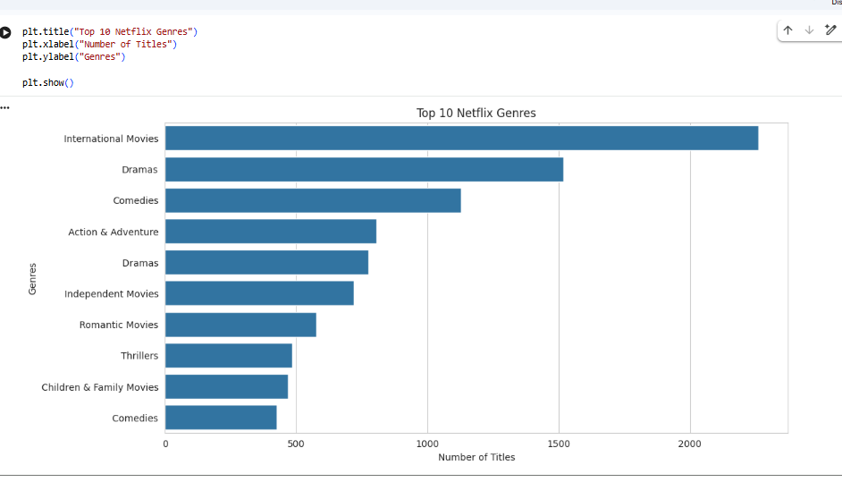

# Netflix Data Analysis 📊

## 📌 Overview
This project analyzes Netflix movies and TV shows data using Python to extract insights and visualize trends.

---

## 🛠️ Tools & Technologies
- Python
- Pandas
- Matplotlib
- Seaborn
- Jupyter Notebook

---

## 📊 Analysis Performed
- Movies vs TV Shows Distribution
- Top Countries Producing Netflix Content
- Netflix Release Trends Over Years
- Top Netflix Genres

---

## 🚀 Skills Demonstrated
- Data Cleaning
- Exploratory Data Analysis (EDA)
- Data Visualization
- Insight Extraction

---

## 📷 Project Screenshots

### Movies vs TV Shows

### Top Countries

### Release Trends

### Top Genres

